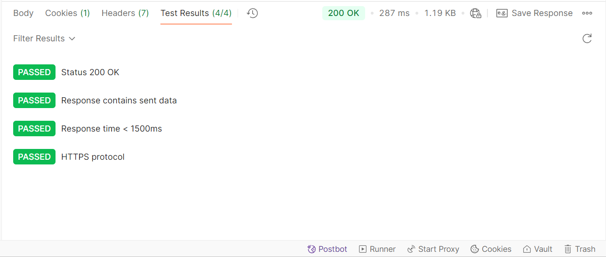
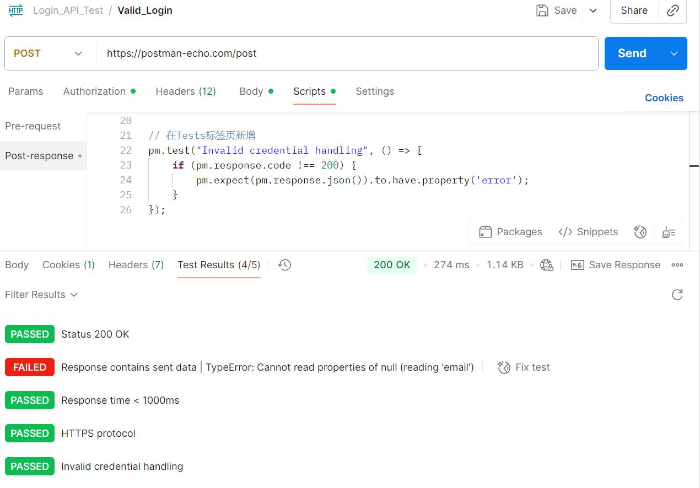

# 🚀 Day2：SQL条件查询与Postman登录接口测试 | 成都测试岗学习日记
> **今日进度**：3/3 ✅ 
## 一、SQL练习环境搭建
为保护Day1的`user`表原始数据，新建练习专用表：
插入练习数据INSERT INTO `user-day2` VALUES 
1. 查询成都用户  
   SELECT * FROM `user-day2` WHERE city='成都';  
2. 统计各城市用户平均年龄
   SELECT city, AVG(age) AS avg_age 
   FROM `user-day2` 
   GROUP BY city;
3. 查找年龄大于 25 的非成都用户  
   SELECT name FROM `user-day2` 
   WHERE age > 25 AND city != '成都';

## 二、Postman登录接口测试

| 任务 | 完成证明 |
|------|----------|
| 正常结果 | 
|异常结果 | 

## 四、测试用例设计
对象：图书管理系统的登录功能  
工具：[XMind]
用例设计维度（至少覆盖）：
mindmap
  root((登录功能))
    功能
      正确账号密码
      错误密码
      空密码
    安全
      SQL注入尝试
      密码加密传输
    性能
      并发登录
      响应时间
    兼容性
      不同浏览器
      移动端
交付成果：导出 `图书登录测试用例.png`，包含 20+ 测试点

## 三、明日计划
Selennium Web自动化环境搭建
